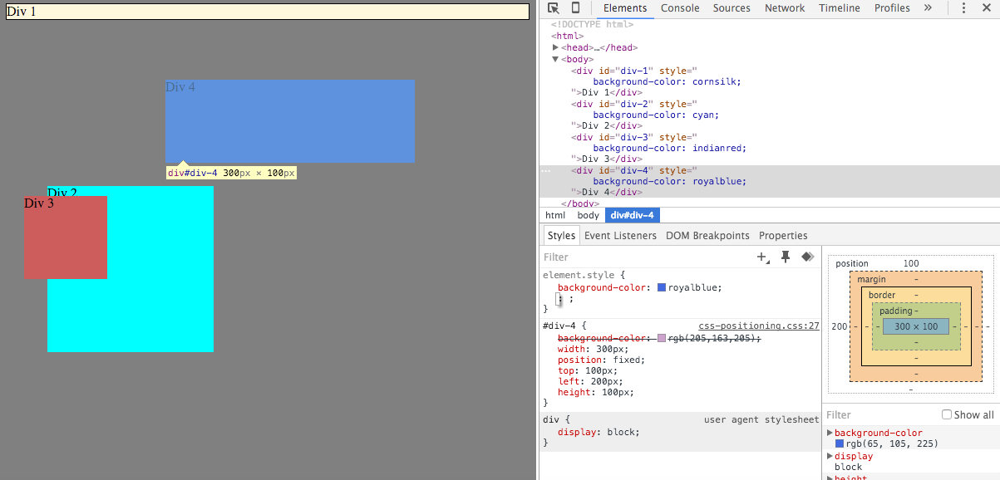
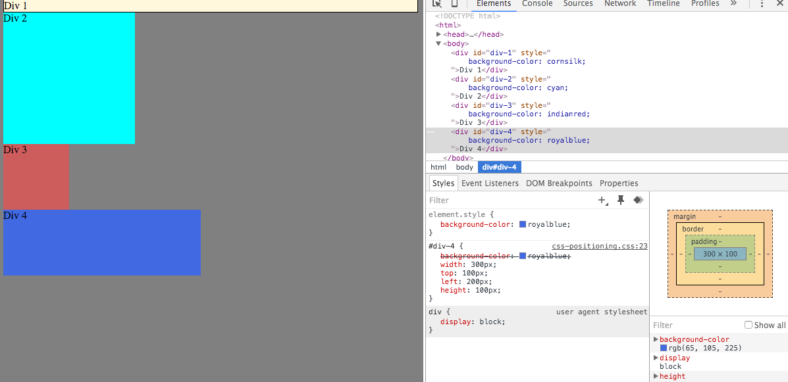
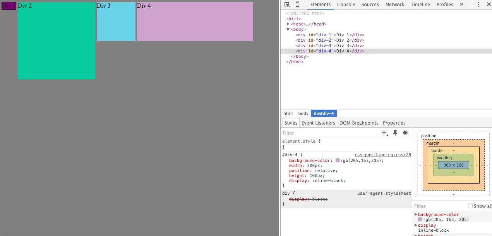
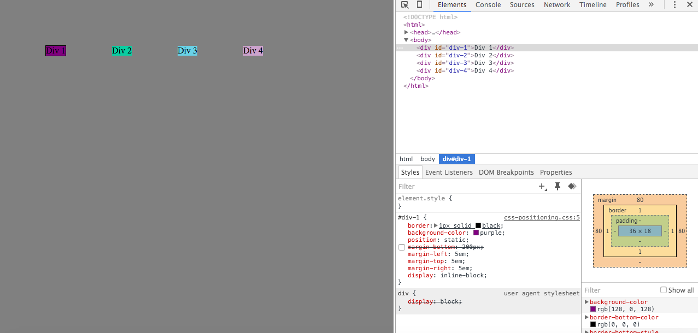
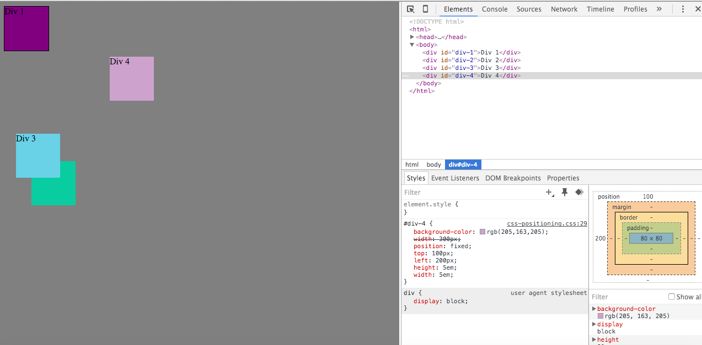
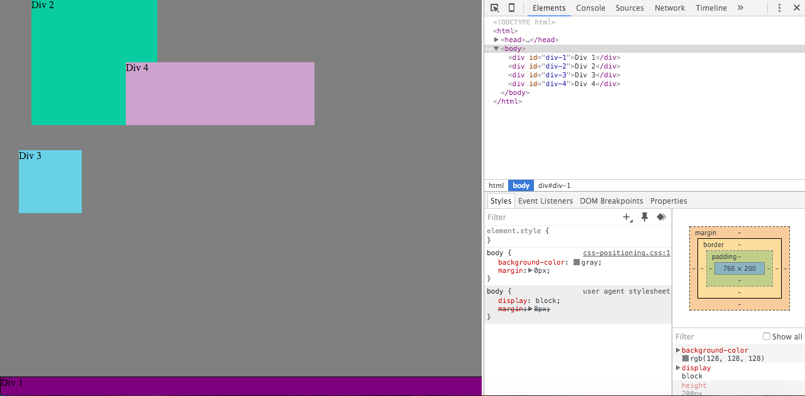
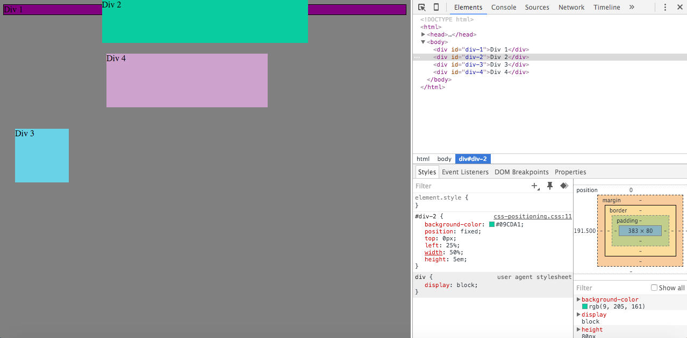
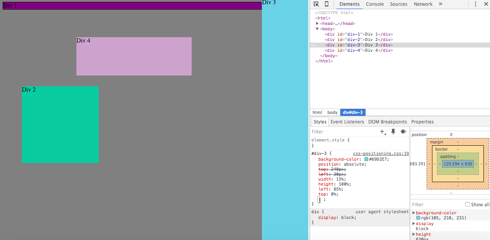

#How can you use Chrome's DevTools inspector to help you format or position elements?
Chrome's DevTools inspector is great to edit your code for designing because it can give you the option to see what you site will look like with out a piece of code just by unchecking a box.

#How can you resize elements on the DOM using CSS?
You add the code to the window that shows the CSS associated to the element when you click on the element you want to edit.

#What are the differences between absolute, fixed, static, and relative positioning? Which did you find easiest to use? Which was most difficult?
Absolute positioning allows you to put an element anywhere you want. Fixed positioning stays in it's spot in the screen even if the user scrolls. Static positioning is the default position an element is set to. Relative positioning allows you to move the element relative to where it normaly be.

#What are the differences between margin, border, and padding?
Margin is how far from the edge of the page you want you element to start. Border is the a the area around an element. Padding is the area between the border and element.

#What was your impression of this challenge overall?
I thought this challenge was more difficult than the others because there seems to be so many things that can affect the positioning of an element. You have to remember to take into account all of them.