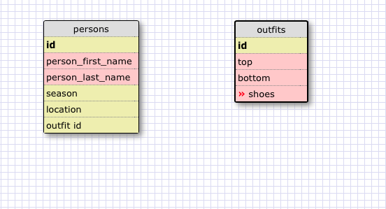

#1.
#SELECT * FROM states;

#2.
#SELECT * FROM regions;

#3.
#SELECT state_name,population FROM states;

#4.
#SELECT state_name,population FROM states ORDER BY population DESC;

#5.
#SELECT state_name FROM states WHERE region_id = 7;

#6.
#SELECT state_name, population_density FROM states WHERE population_density > 50 ORDER BY population_density ASC;

#7.
#ELECT state_name FROM states WHERE population BETWEEN 1000000 and 1500000;

#8.
SELECT state_name, region_id FROM states ORDER BY region_id ASC;

#9.
#SELECT region_name FROM regions WHERE region_name LIKE '%Central%';

#10.
#SELECT regions.region_name, states.state_name FROM regions INNER JOIN states ON regions.id=states.region_id ORDER BY region_id ASC;

#Reflection
#What are databases for?
#Databases are storing large amounts of data.

#What is a one-to-many relationship?
#It means that it fulfills the statement," ___ belongs to a ____. ____ has many ____." For example, a state belongs to a region. Regions have many states.

#What is a primary key? What is a foreign key? How can you determine which is which?
#A primary key identifies entries in the main table while foreign keys identify entries in the secondary table which links to the primary table. You can determine which is which because foreign keys will appear in both tables.

#How can you select information out of a SQL database? What are some general guidelines for that?
#You can select information out of a SQL database by using SQL querries. Some general guidelines for that is to always make sure you are selecting out of the correct table, you can see the column headers and tables by typing .schema, and end each command with a semicolon.
