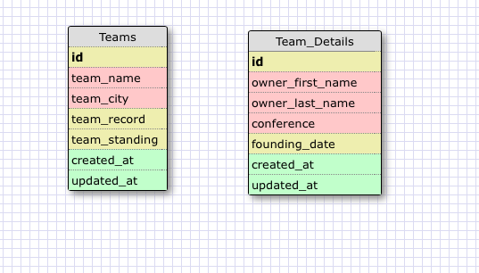
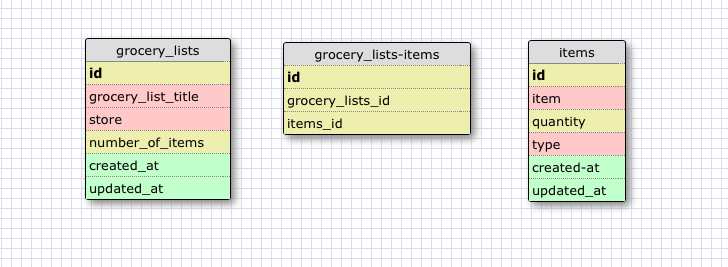

#This is a one to one relationship because everything in the team_details table goes to one id in the teams table. As described in the video, it can easily be combined into one table but these are separated because the team-details table has information that you wouldn't need to access very often.

#What is a one to one database?
#A one to one database is a database that contains two tables and each row in a table can be connected to one row in the other table.

#When would you use a one to one database? (Think generally, not in terms of the example you created).
#You would use a one to one database when some collumns in a table may not often be accessed and therefore can be put into another table. It makes search through the data easier.

#What is a many to many database?
#When the rows in one table can be associated with multiple rows in another table and vice versa.

#When would you use a many to many database? (Think generally, not in terms of the example you created).
#You would use a many to many database when two things (or tables) have multiple instances with eachother.

#What is confusing about database schemas? What makes sense?
#The relationship between many to many databases are difficult to understand because when I try to make a schema on my own I'm not sure what to name the collumns and if I'm putting them in the correct table. What makes sense is the one to one schema and how you would put data that is not often accessed into a different table.